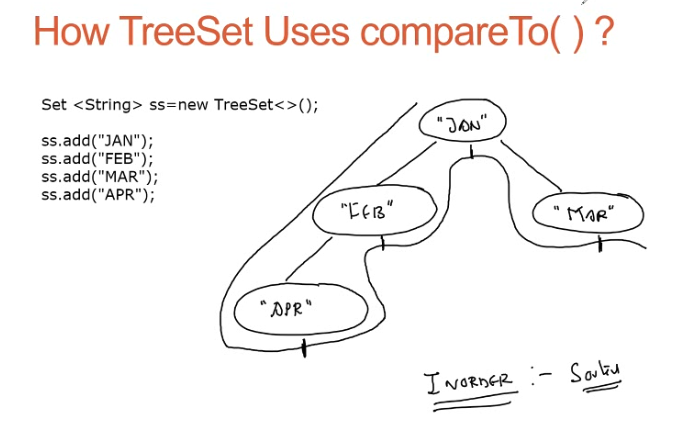

# The `Comparable` Interface 

1. **Comparable interface is used to order the objects of a pre-defined class:**
   - The Comparable interface in Java is used to impose a natural ordering on the objects of a predefined class.
   - By implementing the Comparable interface, a class defines its own custom logic for comparing and ordering its objects.

2. **The Comparable interface is found in the java.lang package and contains only one method named compareTo(Object):**
   - The Comparable interface is located in the java.lang package, which is automatically imported in every Java class.
   - It contains only one method, `compareTo(Object)`, which is used to compare the object with another object to determine their relative ordering.

3. **It provides only a single sorting sequence based on a single data-member:**
   - The Comparable interface provides a single sorting sequence for the objects of a class.
   - This means that objects can be sorted based on a specific data member or property of the class.

4. **public int compareTo(Object o):**
   - The `compareTo(Object)` method is the sole method of the Comparable interface.
   - It compares the current object with the specified object `o` and returns an integer value based on the comparison result.

5. **Compares this object with the specified object for order:**
   - The `compareTo(Object)` method compares the current object (the object on which the method is called) with the specified object `o` to determine their relative order.

6. **Returns a negative integer if this object is less than the specified object:**
   - If the current object is considered "less than" the specified object, the `compareTo(Object)` method returns a negative integer.

7. **Returns a positive integer if this object is greater than the specified object:**
   - If the current object is considered "greater than" the specified object, the `compareTo(Object)` method returns a positive integer.

8. **Returns zero if this object is equal to the specified object:**
   - If the current object is considered "equal to" the specified object, the `compareTo(Object)` method returns zero.

9. **Well-Known Implementation Classes of Comparable:**
   - Many classes in Java implement the Comparable interface to provide a natural ordering for their objects.
   - Some examples of well-known classes that implement Comparable include String, all wrapper classes (Integer, Double, etc.), both Date classes (java.util.Date and java.sql.Date), Calendar, GregorianCalendar, File, and many more.

Understanding the Comparable interface is crucial for sorting and comparing objects in a custom-defined manner. By implementing the Comparable interface and defining the compareTo(Object) method, classes can establish their own 
natural ordering.

# compareTo( ) behaviour with String

```java
System.out.println("A".compareTo("B"));
System.out.println("B".compareTo("A"));
System.out.println("A".compareTo("a"));
System.out.println("A".compareTo(null));
```

**Output:**
```
-1
1
-32
NullPointerException
```

<br/>
<br/>

# How TreeSet Uses compareTo( ) ?



1. **Whenever we use the default constructor of TreeSet to create its object and add values:**
   - When we create a TreeSet object using the default constructor and add values to it, the Java Virtual Machine (JVM) automatically calls the `compareTo()` method of the class to which the object belongs.
   - The `compareTo()` method is used to determine the natural ordering of the objects in the TreeSet.

2. **Default natural sorting order:**
   - The process of sorting elements based on the return value of the `compareTo()` method is known as the default natural sorting order.
   - The `compareTo()` method defines the logic for comparing and ordering the objects in a specific class.

3. **Steps followed by TreeSet when using `compareTo()` method:**
   - When adding objects to a TreeSet using the default constructor, the following steps are followed:
     1. For the first object added, no `compareTo()` method is called since there are no existing objects in the TreeSet.
     2. For the second object added, the `compareTo()` method is called with the current object as the calling object and the existing object as the argument.
     3. If a positive value is returned by the `compareTo()` method, the current object is placed towards the right of the existing object in the tree.
     4. If a non-positive value (zero or negative) is returned by the `compareTo()` method, the current object is placed towards the left of the existing object in the tree.

By utilizing the `compareTo()` method, TreeSet maintains a sorted order of elements based on their natural ordering. The method determines where each object should be placed in the tree structure of TreeSet, either to the left or right, based on the return value of the `compareTo()` method.

Understanding how TreeSet uses the `compareTo()` method is crucial for correctly implementing natural ordering in TreeSet and ensuring the sorted arrangement of elements.

<br/>
<br/>

# How we can override `compareTo( )`?

1. **To implement sorting in TreeSet, we need to override the `compareTo()` method or `compare()` method:**
   - When storing custom objects in a TreeSet, we can achieve automated sorting by implementing either the `compareTo(Object o)` method of the `Comparable` interface or the `compare(Object o1, Object o2)` method of the `Comparator` interface.
   - Most classes implement the `Comparable` interface to define their natural order for sorting.

2. **Points to remember while overriding the `compareTo()` method:**
   - The `compareTo()` method must return a negative number if the current object is considered "less than" the other object, a positive number if the current object is considered "greater than" the other object, and zero if both objects are considered equal.
   - The `compareTo()` method should be consistent with the `equals()` method. If two objects are considered equal based on `equals()`, their `compareTo()` method must return zero. Inconsistent behavior can lead to issues in collections such as `SortedSet` or `SortedMap`.

3. **Example of inconsistency between `equals()` and `compareTo()` in BigDecimal:**
   - The `BigDecimal` class in Java has a `compareTo()` method that is not consistent with the `equals()` method.
   - For example:
     ```java
     BigDecimal bd1 = new BigDecimal("2.0");
     BigDecimal bd2 = new BigDecimal("2.00");
     System.out.println("Comparing BigDecimal using equals: " + bd1.equals(bd2));
     System.out.println("Comparing BigDecimal using compareTo: " + bd1.compareTo(bd2));
     ```
     **Output:**
     ```
     Comparing BigDecimal using equals: false
     Comparing BigDecimal using compareTo: 0
     ```

4. **Effect on collection codes:**
   - The consistency between `equals()` and `compareTo()` is crucial for the behavior of collections like `HashSet` and `TreeSet`.
   - If two objects are considered equal according to `equals()` but their `compareTo()` method returns a non-zero value, storing them in a `HashSet` will result in duplicates violating the rules of a Set.
   - On the other hand, storing them in a `TreeSet` will result in only one element because `TreeSet` uses `compareTo()` to check for duplicates.
   - It is recommended to keep the `compareTo()` method consistent with the `equals()` method to ensure proper behavior in collections.

Understanding the importance of overriding the `compareTo()` method and its consistency with the `equals()` method is crucial for achieving proper sorting and maintaining consistency in collections like `TreeSet`.

<br/>
<br/>

## **Points to remember while overriding the `compareTo()` method:**
   - When overriding the `compareTo()` method, it's important to consider its effect on collection codes.
   - If two objects are stored in a `HashSet`, they will end up as duplicates if the `equals()` method is not properly overridden. This violates the rule of a Set, which should only contain unique elements.
   - On the other hand, if the objects are stored in a `TreeSet`, they will be treated as a single element. This is because `TreeSet` uses the `compareTo()` method to check for duplicates, not the `equals()` method.
   - To ensure consistent behavior across different collections, it is recommended to keep the `compareTo()` method consistent with the `equals()` method in Java.

Understanding the impact of overriding the `compareTo()` method on collection codes helps ensure proper functionality and behavior in different collection implementations.

1. **Example: Storing `BigDecimal` in HashSet and TreeSet:**
   - Let's consider the scenario where we have two `BigDecimal` objects, `bd1` and `bd2`, with values "2.0" and "2.00", respectively.
   - If we store these objects in a `HashSet`, they will be considered as separate elements because `HashSet` uses the `equals()` method to check for duplicates. Thus, both objects will be stored, violating the uniqueness rule.
   - However, if we store them in a `TreeSet`, only one element will be present. This is because `TreeSet` uses the `compareTo()` method to check for duplicates, and since the `compareTo()` method considers them equal, only one element will be stored.

2. **Suggestion to keep `compareTo()` consistent with `equals()` method:**
   - To maintain consistency and avoid unexpected behavior, it is suggested to ensure that the `compareTo()` method is consistent with the `equals()` method.
   - If two objects are considered equal based on the `equals()` method, their `compareTo()` method should return zero.
   - This consistency helps in proper functionality and expected behavior when using collections, ensuring that objects are compared and checked for duplicates correctly.

By keeping the `compareTo()` method consistent with the `equals()` method, we ensure that objects behave consistently across different collections. This helps in avoiding duplicates in Sets and maintaining the expected behavior of collections.

<br/>
<br/>

# **Steps needed to override `equals( )`**

1. **Step 1: Do "this" check**
   - The first step is to perform a reference check using the `==` operator. If the two objects being compared refer to the same memory location, they are considered equal, and the method should return `true`.

2. **Step 2: Do null check**
   - The next step is to check if either of the objects being compared is `null`. If one object is `null` while the other is not, they cannot be considered equal, and the method should return `false`.

3. **Step 3: Do the `instanceof` check**
   - After the reference and null checks, the `instanceof` operator is used to verify if both objects belong to the same class. If they do not belong to the same class, they are not considered equal, and the method should return `false`.

4. **Step 4: Type cast the object**
   - If the `instanceof` check passes, the next step is to type cast one of the objects to the appropriate class. Note that the `instanceof` check should be performed before the type casting to avoid `ClassCastException`.

5. **Step 5: Compare individual attributes**
   - Once the objects are of the same class, individual attributes can be compared to determine equality. It's recommended to start with numeric attributes since numeric comparison is generally faster.
   - Use short-circuit operators (`&&` or `||`) to combine multiple attribute checks efficiently. If the first attribute does not match, there's no need to compare the remaining attributes, and the method should return `false`.

By following these steps, the `equals()` method can be properly overridden to provide a meaningful comparison between objects. These steps ensure that the method correctly handles different scenarios, such as reference checks, null checks, type checks, and attribute comparisons.

It's important to note that overriding the `equals()` method should be done consistently with the `hashCode()` method to maintain the contract between equality and hash-based collections.

## Sample Code 

The code provided is an example of overriding the `equals()` method in the `Person` class. Let's break it down and understand each part:

```java
class Person {
    private String name;
    private int age;

    public Person(String name, int age) {
        this.name = name;
        this.age = age;
    }

    public boolean equals(Object other) {
        if (this == other)
            return true;
        if (other == null || other instanceof Person == false)
            return false;
        Person second = (Person) other;
        return age == second.age && ((name == second.name) || (name != null && name.equals(second.name)));
    }
}
```

- The `Person` class represents a person with a name and age.
- The `equals()` method is overridden to provide a custom comparison for `Person` objects.
- In the `equals()` method:
  - The first check `if (this == other)` ensures that the two objects are the same instance. If true, they are considered equal, and `true` is returned.
  - The second check `if (other == null || other instanceof Person == false)` verifies if the `other` object is `null` or not an instance of the `Person` class. If either condition is true, the objects are not equal, and `false` is returned.
  - The `other` object is then typecasted to a `Person` object for attribute comparison.
  - The attributes `age` and `name` are compared using logical operators (`&&`, `||`) to determine equality. Age is compared using `==`, and the name is compared using `equals()` to handle potential `null` values safely.

This implementation follows the recommended steps for overriding the `equals()` method:
1. Reference check (`this == other`).
2. Null check (`other == null`).
3. `instanceof` check (`other instanceof Person`).
4. Type casting (`Person second = (Person) other`).
5. Comparison of individual attributes (`age` and `name`).

By providing a custom implementation of the `equals()` method, objects of the `Person` class can be compared for equality based on their age and name attributes.

<br/>
<br/>
<br/>

# Important Points to remember while overriding the method `compareTo( )`


1. **`compareTo()` must throw `NullPointerException` when compared to `null`:**
   - The `compareTo()` method should throw a `NullPointerException` if the current object is compared to a `null` object. This is different from the `equals()` method, which simply returns `false` in such a scenario.

2. **Order of comparison in `compareTo()`:**
   - When comparing objects using the `compareTo()` method, the order of comparison matters. If there are multiple significant fields to compare, it's recommended to start with the most significant field and proceed to the least significant field.

3. **Difference between `compareTo()` and `equals()`:**
   - The `compareTo()` method is used for comparison, and the order of comparison matters. In contrast, the `equals()` method is used for equality checks, and the order of comparison does not matter.

4. **Overriding `hashCode()` when overriding both `equals()` and `compareTo()`:**
   - When overriding both the `equals()` and `compareTo()` methods, it is necessary to override the `hashCode()` method as well. Failure to do so can result in a violation of the general contract for `Object.hashCode()`, causing issues with hash-based collections like `HashMap`, `HashSet`, and `Hashtable`.

5. **Implications on hash-based collections:**
   - If only the `equals()` method is overridden, objects that are considered equal but have different hash codes will not be properly recognized by hash-based collections. They may end up in different buckets, leading to unexpected behavior.

6. **Correct implementation of `hashCode()`:**
   - The `hashCode()` method is crucial when using objects in hash-based collection classes like `Hashtable` and `HashMap`.
   - A well-written `hashCode()` method distributes objects uniformly and avoids collisions, improving the performance of hash-based collections.

By considering these points while overriding the `compareTo()` method and understanding its relationship with the `equals()` method and `hashCode()`, we can ensure consistent and correct behavior when working with comparisons and hash-based collections.

<br/>
<br/>

# How can we change natural sort order ?

**1. If we are not satisfied with the default natural sorting order:**
   - The default natural sorting order is provided by the `Comparable` interface, where objects are sorted based on their natural ordering.
   - If we want to change the sorting order, such as sorting strings in descending order instead of ascending order, or if the default natural sorting is not available (like for `StringBuffer`), we can use the `Comparator` interface.

**2. Using `java.util.Comparator` for customized sorting:**
   - The `Comparator` interface allows us to define our own customized sorting logic for objects.
   - We can create a separate class that implements the `Comparator` interface and override the `compare()` method.
   - In the `compare()` method, we define the comparison logic based on our desired sorting criteria.
   - We return a negative integer if the first object is considered "less than" the second object, a positive integer if the first object is considered "greater than" the second object, and 0 if the two objects are considered equal.
   - By using the `Comparator`, we can specify the exact order in which objects should be sorted, regardless of their default natural ordering.

In summary, the `Comparable` interface is used for default natural sorting, where objects are sorted based on their natural ordering. On the other hand, the `Comparator` interface allows us to define our own customized sorting logic for objects, enabling us to change the natural sort order or handle classes that don't have a default natural ordering.

By understanding and utilizing these interfaces effectively, we have the flexibility to achieve the desired sorting behavior in our applications.
