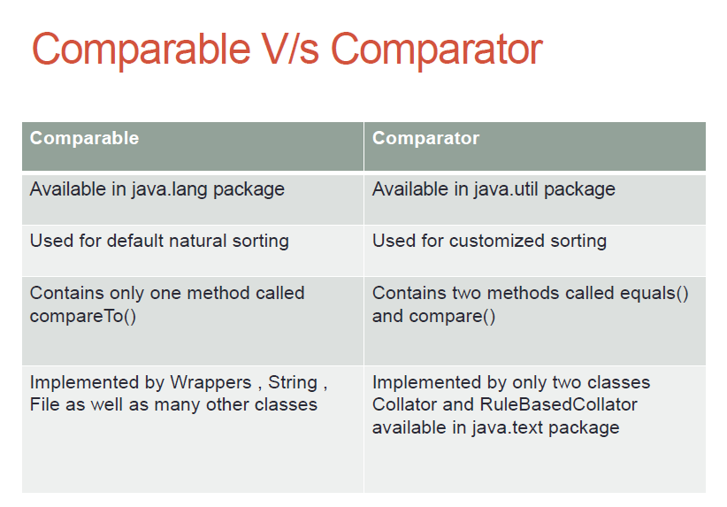

# The Comparator Interface

**1. The Comparator Interface:**

   - The `Comparator` interface is used to order objects of a user-defined class according to custom sorting criteria.
   - This interface is part of the `java.util` package and contains two methods: `equals()` and `compare()`.

**2. Syntax of the `compare()` method:**

   - The `compare()` method has the following syntax: `public int compare(Object obj1, Object obj2)`.
   - It compares two objects and determines their order.
   - The method returns a negative integer if the first argument is considered "less than" the second argument, zero if they are considered equal, and a positive integer if the first argument is considered "greater than" the second argument.

**3. Important points regarding Comparator:**

   - When using the `Comparator` interface, the objects being compared do not need to implement the `Comparable` interface.
   - This means that we can sort objects that are not naturally sortable or do not have a default natural ordering.
   - For example, we can sort `StringBuffer` objects using a `Comparator`.
   - Additionally, when using the `Comparator` interface, the objects being compared do not need to be of the same type. We can compare heterogeneous objects as well.

By using the `Comparator` interface, we have the flexibility to define custom sorting logic for our user-defined classes. This allows us to sort objects based on specific criteria that may not be covered by their natural ordering or when comparing objects of different types.



**Exercise 1: Sort Integers in Descending Order using TreeSet**
```java
import java.util.*;
public class IntegerDescendingSort {
    public static void main(String[] args) {
        Set<Integer> ss=new TreeSet<>(new MyIntComparator());
        ss.add(10);
        ss.add(5);
        ss.add(20);
        ss.add(7);
        ss.add(2);
        System.out.println(ss);
        
    }
}
class MyIntComparator implements Comparator
{

    @Override
    public int compare(Object o1, Object o2) {
        
        Integer i1=(Integer)o1;
        Integer i2=(Integer)o2;
        return i2-i1;
    }
    
}
```

**Exercise 2: Sort Strings in Descending Order using TreeSet**
```java
import java.util.*;
public class StringDescendingSort {
    public static void main(String[] args) {
        Set<String> ss=new TreeSet<>(new MyStringComparator());
        ss.add("Bhopal");
        ss.add("India");
        ss.add("Indore");
        ss.add("Delhi");
        ss.add("Mumbai");
        System.out.println(ss);
        
    }
}
class MyStringComparator implements Comparator
{

    @Override
    public int compare(Object o1, Object o2) {
        
        String s1=(String)o1;
        String s2=(String)o2;
        return s2.compareTo(s1);
    }
    
}
```

**Exercise 3: Sort String and StringBuffer objects based on length and alphabetical order**
```java
import java.util.*;
public class StringAndStringBufferSort {
    public static void main(String[] args) {
        TreeSet ss=new TreeSet(new MyStringComparator());
        ss.add("Bhopal");
        ss.add(new StringBuffer("India"));
        ss.add("Indore");
        ss.add(new StringBuffer("Delhi"));
        ss.add("Mumbai");
        System.out.println(ss);
        
    }
}
class MyStringComparator implements Comparator
{

    @Override
    public int compare(Object o1, Object o2) {
        
        String s1=o1.toString();
        String s2=o2.toString();
        int x= s1.length()-s2.length();
        if(x!=0)
            return x;
        return s1.compareTo(s2);
    }
    
}
```

**Exercise 4: Sort Person objects in alphabetical order of name**
```java
import java.util.Comparator;
import java.util.TreeSet;

class Person {
    private String name;
    
    public Person(String name) {
        this.name = name;
    }
    
    public String getName() {
        return name;
    }
    
    @Override
    public String toString() {
        return name;
    }
}

public class PersonNameSort {
    public static void main(String[] args) {
        TreeSet<Person> treeSet = new TreeSet<>(Comparator.comparing(Person::getName));
        
        treeSet.add(new Person("John"));
        treeSet.add(new Person("Alice"));
        treeSet.add(new Person("Bob"));
        treeSet.add(new Person("Carol"));
        
        for (Person person : treeSet) {
            System.out.println(person);
        }
    }
}
```
