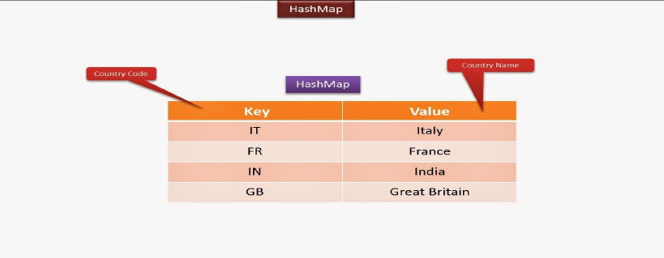
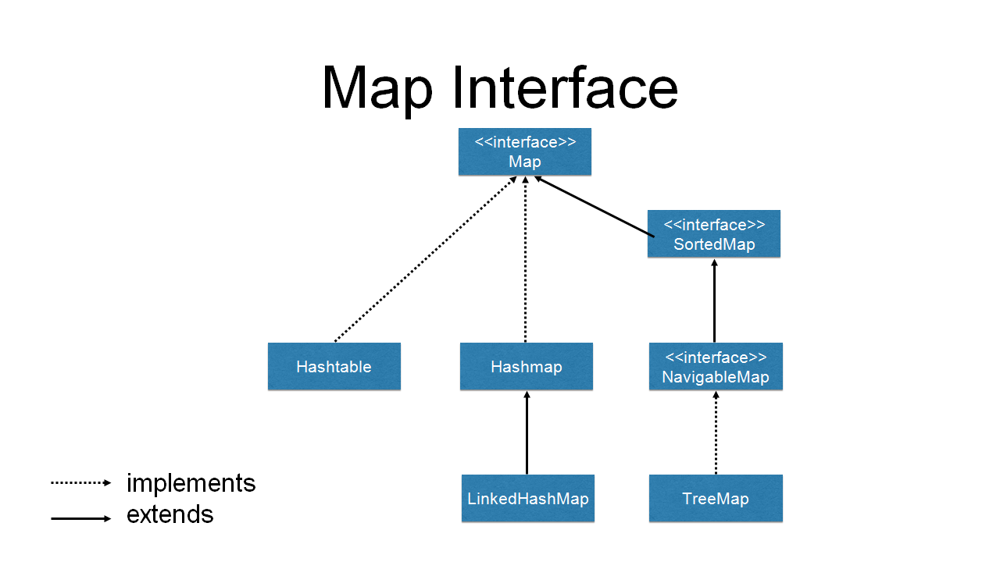
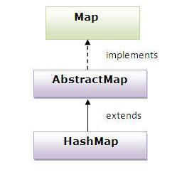

# **The `Map` Interface**

The Map interface in Java represents an object that maps keys to values. It is not a child interface of the Collection interface but shares some common methods. Here are the detailed explanations of the points you mentioned:



**Main Purpose**: The Map interface is mainly used for lookups, where you can retrieve a value associated with a specific key.

**No Duplicate Keys**: A Map cannot contain duplicate keys. Each key can map to at most one value.

**Methods**: The Map interface provides methods for basic operations such as `put()`, `get()`, `remove()`, `containsKey()`, `containsValue()`, `size()`, and `isEmpty()`.

**Collection Views**: It also provides methods for collection views of its contents, such as `keySet()`, `values()`, and `entrySet()`, which allow you to access the keys, values, and entries (key-value pairs) of the map.

**Implementation Classes**: Some commonly used implementation classes of the Map interface are `HashMap`, `TreeMap`, `LinkedHashMap`, and `ConcurrentHashMap`.

## **Here are explanations of the commonly used methods of the Map interface:**

- **`clear()`**: Removes all key/value pairs from the map.
- **`containsKey(Object k)`**: Returns true if the map contains the specified key, false otherwise.
- **`containsValue(Object v)`**: Returns true if the map contains the specified value, false otherwise.
- **`entrySet()`**: Returns a Set that contains the entries (key-value pairs) of the map.
- **`equals(Object obj)`**: Returns true if the specified object is a Map and contains the same entries as the invoking map.
- **`get(Object k)`**: Returns the value associated with the specified key.
- **`isEmpty()`**: Returns true if the map is empty, false otherwise.
- **`keySet()`**: Returns a Set that contains all the keys in the map.
- **`put(Object k, Object v)`**: Associates the specified value with the specified key in the map. Returns the previous value associated with the key, or null if there was no mapping for the key.
- **`replace(Object k, Object v)`**: Replaces the value for the specified key if it exists. Returns the previous value associated with the key, or null if there was no mapping for the key.
- **`remove(Object k)`**: Removes the entry with the specified key from the map. Returns the value associated with the key, or null if there was no mapping for the key.
- **`values()`**: Returns a collection containing all the values in the map.
- **`size()`**: Returns the number of key/value pairs in the map.

These methods provide various ways to manipulate and retrieve data from a Map, making it a versatile interface for key-value mappings.



<br/>
<br/>

# **The `HashMap` class**

The `HashMap` class in Java extends `AbstractMap` and implements the `Map` interface. It is a commonly used data structure for storing key-value pairs. Let's dive into the details of the `HashMap` class:



**Internal Implementation**: Internally, `HashMap` uses a `HashTable` to store the key-value pairs. The `HashTable` uses a hash function to determine the index of each entry in the underlying array, allowing for efficient retrieval of objects based on their keys.

**Unsynchronized Methods**: `HashMap` methods are not synchronized by default, meaning they are not thread-safe. If multiple threads access a `HashMap` concurrently and at least one of the threads modifies the map structurally (e.g., adding or removing elements), it must be synchronized externally.

**Support for Null**: `HashMap` allows `null` keys and `null` values. This means you can store key-value pairs where either the key or the value (or both) is `null`.

**Ordering of Elements**: `HashMap` is not an ordered collection, which means it does not guarantee that the keys and values will be returned in the same order they were inserted. It does not perform any kind of sorting on the stored keys and values.

**Constant Time Retrieval**: `HashMap` provides constant-time retrieval of objects based on their keys, meaning the retrieval time is generally very efficient, O(1).

**Constructors**:
1. **HashMap()**: This constructs an empty `HashMap` with the default initial capacity (16) and the default load factor (0.75).
2. **HashMap(int initialCapacity)**: Constructs an empty `HashMap` with the specified initial capacity and the default load factor (0.75).
3. **HashMap(int initialCapacity, float loadFactor)**: Constructs an empty `HashMap` with the specified initial capacity and load factor. The load factor determines how full the `HashMap` can be before it is resized (rehashed).
4. **HashMap(Map m)**: Constructs a new `HashMap` with the same mappings as the specified `Map`.

In summary, `HashMap` is a versatile class for efficiently storing and retrieving key-value pairs. It is widely used in Java applications for tasks like caching, indexing, and fast lookups. However, developers must be cautious about using `HashMap` in concurrent environments to avoid potential synchronization issues.

<br/>
<br/>

# Here's the Java program to store the given values in a HashMap and print them:

```java
import java.util.HashMap;
import java.util.Map;

public class HashMapExample {
    public static void main(String[] args) {
        // Create a HashMap to store the Roll No and Name
        Map<Integer, String> studentMap = new HashMap<>();

        // Add values to the HashMap
        studentMap.put(101, "Amit");
        studentMap.put(102, "Sumit");
        studentMap.put(103, "Chetan");

        // Print the Roll No and Name
        System.out.println("Roll No\tName");
        for (Map.Entry<Integer, String> entry : studentMap.entrySet()) {
            System.out.println(entry.getKey() + "\t" + entry.getValue());
        }
    }
}
```

Output:
```
Roll No   Name
101       Amit
102       Sumit
103       Chetan
```

Now, to modify the code to display only the values (i.e., names), we can remove the Roll No from the output:

```java
import java.util.HashMap;
import java.util.Map;

public class HashMapExample {
    public static void main(String[] args) {
        // Create a HashMap to store the Roll No and Name
        Map<Integer, String> studentMap = new HashMap<>();

        // Add values to the HashMap
        studentMap.put(101, "Amit");
        studentMap.put(102, "Sumit");
        studentMap.put(103, "Chetan");

        // Print only the Names
        System.out.println("Name");
        for (String name : studentMap.values()) {
            System.out.println(name);
        }
    }
}
```

Output:
```
Name
Amit
Sumit
Chetan
```

Now, the modified code only displays the names stored in the HashMap.

<br/>
<br/>

# Using `entrySet` Method For Traversal

The `entrySet()` method in the `Map` interface is used for traversal and returns a `Set` containing objects of the `Entry` interface, which is defined in the `Map` interface. Each `Entry` object represents a key-value pair in the map.

The `Entry` interface has the following methods:

1. `boolean equals(Object obj)`: This method returns true if the specified object `obj` is a `Map.Entry` and its key and value are equal to that of the invoking object.

2. `Object getKey()`: This method returns the key associated with the current map entry.

3. `Object getValue()`: This method returns the value associated with the current map entry.

4. `int hashCode()`: This method returns the hash code for the current map entry.

5. `Object setValue(Object v)`: This method sets the value for the current map entry to the specified value `v`. It returns the previous value associated with the key or null if there was no previous value. If `v` is not the correct type for the map, a `ClassCastException` is thrown. If `v` is null and the map does not permit null values, a `NullPointerException` is thrown. If the map cannot be changed, an `UnsupportedOperationException` is thrown.

Here's an example code snippet demonstrating the use of the `entrySet()` method and the methods of the `Entry` interface:

```java
import java.util.HashMap;
import java.util.Map;

public class EntrySetExample {
    public static void main(String[] args) {
        Map<String, Integer> scoreMap = new HashMap<>();
        scoreMap.put("Alice", 90);
        scoreMap.put("Bob", 85);
        scoreMap.put("Charlie", 95);

        // Using entrySet() to traverse the map
        for (Map.Entry<String, Integer> entry : scoreMap.entrySet()) {
            String name = entry.getKey();
            int score = entry.getValue();
            System.out.println(name + ": " + score);
        }
    }
}
```

Output:
```
Alice: 90
Bob: 85
Charlie: 95
```

In this example, we use the `entrySet()` method to obtain a `Set` of `Map.Entry` objects from the `scoreMap`. Then, we iterate over each `Entry` object and extract the key and value using the `getKey()` and `getValue()` methods, respectively. We print the key-value pairs of the map in the output.

<br/>
<br/>

# Important `Quizes`

1. Which of these methods deletes all the elements from the invoking collection?
   a) `clear()`
   b) `reset()`
   c) `delete()`
   d) `clearAll()`<br/>
   **Answer: a) `clear()`**
   
   Explanation: The `clear()` method is used to remove all elements from the collection, leaving it empty. It clears the collection and makes it ready for new elements to be added.

2. Suppose that you would like to create an instance of a new Map that has an iteration order that is the same as the iteration order of an existing instance of a Map. Which concrete implementation of the Map interface should be used for the new instance?
   a) `TreeMap`
   b) `HashMap`
   c) `LinkedHashMap`<br/>
   **Answer: c) `LinkedHashMap`**
   
   Explanation: `LinkedHashMap` maintains the order of insertion, so if you want to create a new `Map` with the same iteration order as an existing `LinkedHashMap`, you should use `LinkedHashMap`.

3. Tell the output
   ```java
   import java.util.*;

   class StackExample {
       public static void main(String args[]) {
           Stack<Integer> obj = new Stack<>();
           obj.push(new Integer(3));
           obj.push(new Integer(2));
           obj.pop();
           obj.push(new Integer(5));
           System.out.println(obj);
       }
   }
   ```
   a) [3, 5]
   b) [3, 2]
   c) [3, 2, 5]
   d) [3, 5, 2]<br/>
   **Answer: a) [3, 5]**
   
   Explanation: The code pushes 3 and 2 into the stack, then pops 2 from the stack. Finally, it pushes 5 into the stack. The `System.out.println(obj)` statement prints the contents of the stack, which are [3, 5].

4. Which collection class allows you to grow or shrink its size and provides indexed access to its elements, but whose methods are not synchronized?
   a) `java.util.HashSet`
   b) `java.util.LinkedHashSet`
   c) `java.util.List`
   d) `java.util.ArrayList`<br/>
   **Answer: d) `java.util.ArrayList`**
   
   Explanation: `ArrayList` allows you to dynamically grow or shrink its size, provides indexed access to elements, and its methods are not synchronized, meaning it is not thread-safe.

5. You need to store elements in a collection that guarantees that no duplicates are stored and all elements can be accessed in natural order. Which interface provides that capability?
   a) `java.util.Map`
   b) `java.util.Set`
   c) `java.util.List`
   d) `java.util.Collection`<br/>
   **Answer: b) `java.util.Set`**
   
   Explanation: `Set` guarantees that no duplicates are stored, and depending on the specific implementation (e.g., `TreeSet`), it can also maintain elements in natural order.

6. Which collection class allows you to access its elements by associating a key with an element's value and provides synchronization?
   a) `java.util.SortedMap`
   b) `java.util.TreeMap`
   c) `java.util.TreeSet`
   d) `java.util.Hashtable`<br/>
   **Answer: d) `java.util.Hashtable`**
   
   Explanation: `Hashtable` allows you to access elements using keys and provides synchronization, making it thread-safe.

7. Class Test1:
   ```java
   class Test1 {
       public int value;
       public int hashCode() { return 42; }
   }
   ```
   Class Test2:
   ```java
   class Test2 {
       public int value;
       public int hashCode() { return (int)(value^5); }
   }
   ```
   a) Class Test1 will not compile.
   b) The Test1 hashCode() method is more efficient than the Test2 hashCode() method.
   c) The Test1 hashCode() method is less efficient than the Test2 hashCode() method.
   d) Class Test2 will not compile.<br/>
   **Answer: c)**
   
   Explanation: Both `Test1` and `Test2` classes compile successfully. However, the hashCode() method in `Test1` simply returns a constant value (42), which may not be very efficient for a hash-based collection. In contrast, the hashCode() method in `Test2` uses bitwise XOR to calculate a hash code based on the value field, which could be more efficient and less likely to cause hash collisions.

8. What two statements are true about properly overridden hashCode() and equals() methods?
   1) hashCode() doesn't have to be overridden if equals() is.
   2) equals() doesn't have to be overridden if hashCode() is.
   3) hashCode() can always return the same value, regardless of the object that invoked it.
   4) equals() can be true even if it's comparing different objects.<br/>
   **Answer: c) 3 and 4**
   
   Explanation: 
   1) It is generally recommended to override both `hashCode()` and `equals()` together, as they work together to ensure the consistency of object comparison and hashing in hash-based collections.
   2) If `equals()` is overridden, `hashCode()` should also be overridden to ensure that equal objects have the same hash code. However, the reverse is not true; `hashCode()` can be overridden even if `equals()` is not overridden.
   3) `hashCode()` can indeed return the same value for different objects, but it is not recommended to do so. It is better to provide a good distribution of hash codes to minimize collisions.
   4) If `equals()` returns true for two different objects, it does not necessarily mean that their hash codes must be the same. However, it is a good practice to ensure that objects with equal content have equal hash codes to avoid unnecessary collisions in hash-based collections.

9. Which two statements are true about comparing two instances of the same class, given that the `equals()` and `hashCode()` methods have been properly overridden?
   1) If the `equals()` method returns true, the hashCode() comparison `==` must return true.
   2) If the `equals()` method returns false, the hashCode() comparison `!=` must return true.
   3) If the hashCode() comparison `==` returns true, the `equals()` method must return true.
   4) If the hashCode() comparison `==` returns true, the `equals()` method might return true.<br/>
   **Answer: a) 1 and 4**
   
   Explanation:
   1) If the `equals()` method returns true for two objects, it means that these objects are considered equal based on their content. In this case, the `hashCode()` comparison using `==` will also return true because equal objects must have the same hash code.
   2) If the `equals()` method returns false for two objects, it means that these objects are not considered equal based on their content. The `hashCode()` comparison using `!=` can return either true or false, depending on whether the objects have the same or different hash codes. The hash codes may be different even for unequal objects to minimize collisions in hash-based collections.
   3) If the hashCode() comparison `==` returns true, it means that two objects have the same hash code. However, this does not necessarily imply that the `equals()` method must return true. Hash code collisions can occur, and the `equals()` method should be used to determine actual equality.
   4) If the hashCode() comparison `==` returns true, it means that two objects have the same hash code, and it is likely that the `equals()` method will return true. However, due to hash code collisions, it is possible for unequal objects to have the same hash code, and the `equals()` method should be used for a definitive equality check.

10. Which of the following are true statements?
    1. The `Iterator` interface declares only three methods: `hasNext`, `next`, and `remove`.
    2. The `ListIterator` interface extends both the `List` and `Iterator` interfaces.
    3. The `ListIterator` interface provides forward and backward iteration capabilities.
    4. The `ListIterator` interface provides the ability to modify the List during iteration.
    5. The `ListIterator` interface provides the ability to determine its position in the List.<br/>
    **Answer: b) 1, 3, 4, and 5**
    
    Explanation:
    1. The `Iterator` interface indeed declares three methods: `hasNext()`, `next()`, and `remove()`. It is used to traverse a collection and remove elements during iteration.
    2. The `ListIterator` interface does extend both the `List` and `Iterator` interfaces. It extends `Iterator` and provides additional methods for bidirectional iteration and modification of the list.
    3. The `ListIterator` interface provides methods for forward and backward iteration. It allows iterating over a list in both directions using methods like `hasPrevious()` and `previous()`.
    4. The `ListIterator` interface provides the ability to modify the list during iteration. It includes methods like `add()`, `set()`, and `remove()`, which allow adding, modifying, and removing elements while iterating over the list.
    5. The `ListIterator` interface provides the ability to determine its position in the list using methods like `nextIndex()` and `previousIndex()`, which return the index of the next and previous elements, respectively.