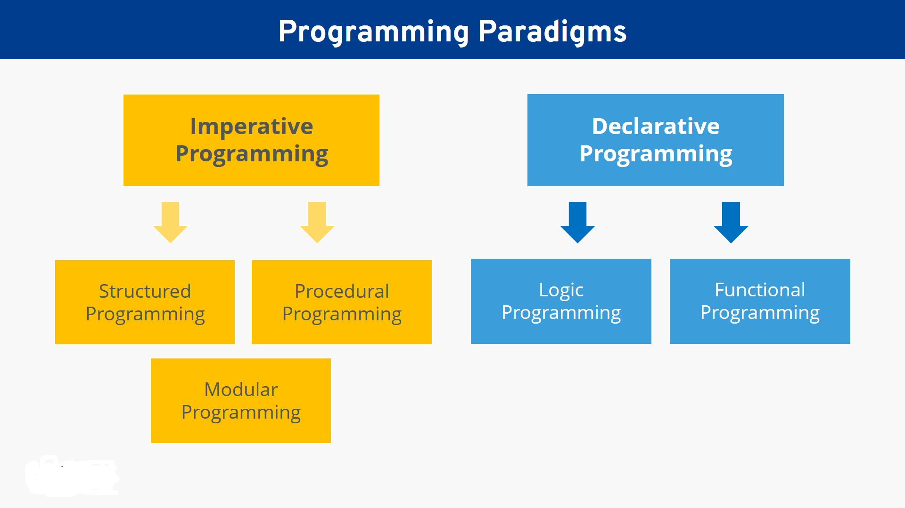

1. **What Is Modern Java?**

   Modern Java refers to the recent versions of the Java programming language, starting from Java 8 and beyond. These versions introduced significant changes and new features to the language, enabling developers to write more concise, expressive, and efficient code. Modern Java includes improvements in syntax, libraries, and language constructs that make it easier to work with complex data structures, handle concurrency, and adopt functional programming paradigms.

2. **What Is LTS and STS?**

   - **LTS (Long-Term Support):** LTS releases in Java are versions that are designated to receive long-term support and updates for an extended period, typically for several years. These releases are intended for use in production environments where stability and long-term maintenance are critical. Java 8 and Java 11 are examples of LTS versions.

   - **STS (Short-Term Support):** STS releases are versions that do not receive long-term support and have a shorter lifecycle. They may introduce new features and enhancements but are generally replaced by the next STS or LTS release in a relatively short period. Developers often use STS releases to take advantage of the latest features and improvements.

3. **Why Java 8 Is So Popular?**

   Java 8 introduced several significant features, making it one of the most popular releases in the history of Java. The main reasons for Java 8's popularity are:

   - **Lambda Expressions:** Lambda expressions enable functional programming in Java, allowing developers to write more concise and expressive code, especially when dealing with collections and streams.

   - **Streams API:** The Streams API provides a powerful and declarative way to perform bulk data operations on collections, making it easier to filter, map, and aggregate data.

   - **Default Methods in Interfaces:** Java 8 introduced the ability to have default methods in interfaces, enabling backward compatibility and easier evolution of existing APIs.

   - **Functional Interfaces:** Functional interfaces are interfaces with a single abstract method, and they serve as the foundation for using lambda expressions in Java.

   - **Optional Class:** The Optional class helps in avoiding null pointer exceptions and promoting better practices for handling potentially absent values.

4. **New Features Of Java 8**

   Java 8 introduced several new features and improvements, some of which are mentioned above. Here is a summary of the main features:

   - **Lambda Expressions:** Lambda expressions provide a concise syntax to represent anonymous functions, enabling functional programming in Java.

   - **Streams API:** The Streams API facilitates the processing of collections and supports parallelism for enhanced performance.

   - **Default Methods in Interfaces:** Default methods allow the addition of new methods to existing interfaces without breaking compatibility with implementing classes.

   - **Functional Interfaces:** Functional interfaces are interfaces with a single abstract method, suitable for use with lambda expressions.

   - **Optional Class:** The Optional class helps avoid null pointer exceptions and provides a more robust way of dealing with potentially absent values.

   - **New Date and Time API:** Java 8 introduced the `java.time` package to handle date and time in a more modern and intuitive way.

   - **Nashorn JavaScript Engine:** Java 8 introduced the Nashorn JavaScript engine for executing JavaScript code within Java applications.

   - **CompletableFuture:** The CompletableFuture class offers a powerful way to manage asynchronous computations and handle complex workflows in concurrent programming.

   - **Method References:** Method references allow the reference to a method by its name, providing a shorthand notation for lambda expressions.

   - **Compact Profiles:** Java 8 introduced Compact Profiles to define smaller subsets of the Java SE platform to optimize applications for specific environments.

   These features have transformed Java programming and opened up new possibilities for developers to write more expressive, efficient, and concise code.

<br/>
<br/>

**Declarative Programming:**
Declarative programming is a programming paradigm where we express the desired outcome or the logic of a computation without explicitly stating the step-by-step instructions to achieve it. In declarative programming, the focus is on "what" needs to be done rather than "how" it should be done. The source code is written in a more expressive and high-level manner, which makes it easier to understand and maintain.

**Imperative Programming:**
Imperative programming, on the other hand, is the traditional approach that most programming languages, including older versions of Java, follow. In imperative programming, we explicitly specify the sequence of steps or instructions that the computer needs to execute to achieve the desired outcome. The emphasis is on "how" to perform the computation or solve the problem, step by step.

**Example: Going to a Restaurant**
Consider the scenario where you and your friends go to a restaurant and need to find a table. The approach to finding a table can be explained in both imperative and declarative ways:

- **Imperative Approach:**
  "I see that table located under the AC is empty. We all are going to walk over there and sit down."

- **Declarative Approach:**
  "Table for six, please."

In the declarative approach, you express your desired outcome directly, requesting a table for six people. You don't need to specify each step to get to the table; you leave that responsibility to the restaurant staff.

**Another Example: Giving Directions**
Imagine a friend is coming to your home for the first time and asks for directions. You can respond using both imperative and declarative approaches:

- **Imperative Response:**
  "Go out of the north side of the parking lot and take a left. Get to the 2nd lane. Take a right off and go straight and take a right at the first lamp post. Continue through the 2nd lamp post, then take your next left. My house is #305."

- **Declarative Approach:**
  "My address is 305, E-4/799, Arera-462019."

In the declarative approach, you simply provide the address, expressing the desired outcome, which is to reach your house. You don't give step-by-step directions, leaving it to your friend to find the best route to the specified address.

**Benefits of Declarative Programming:**
- **Simplicity:** Declarative code is often simpler and more concise, as it focuses on the desired outcome rather than the specific implementation details.
- **Readability:** Declarative code is usually easier to read and understand, as it uses a more natural and human-readable representation of the problem.
- **Abstraction:** Declarative programming allows for higher levels of abstraction, making it easier to manage complexity and modularize code.
- **Maintainability:** Declarative code is often more maintainable, as changes to the implementation can be isolated without affecting the overall logic.
- **Parallelism:** Declarative code can often be parallelized more easily, allowing for better performance on multi-core systems.

Java 8 introduced features like lambda expressions and the Streams API that enable a more declarative style of programming, leading to cleaner and more expressive code.

<br/>
<br/>

# Well Known Examples Of Declarative Programming

**SQL (Structured Query Language):**
SQL is a prime example of declarative programming. It is a domain-specific language used for managing and manipulating relational databases. When writing SQL queries, we describe the data we want to retrieve or modify without specifying how the database management system (DBMS) should perform the operations.

For example, consider the SQL query:
```
SELECT * FROM employee WHERE empno = 101;
```
In this query, we are instructing the DBMS to retrieve all columns (`*`) from the `employee` table where the `empno` column has the value 101. We don't need to specify the underlying data structures, algorithms, or optimizations to achieve this. The DBMS takes care of the actual implementation details.

**HTML/CSS (Hypertext Markup Language / Cascading Style Sheets):**
HTML and CSS are also prominent examples of declarative programming used in web development. HTML is a markup language used to structure content on web pages, while CSS is used to style the presentation of HTML elements.

Consider the following HTML code:
```html
<body>
  <h1>Learning Java 8</h1>
  <p>
    A great way to become <b>SMART PROGRAMMER</b>
  </p>
</body>
```
In this HTML code, we are describing the structure of the content on the web page. We use `<h1>` to indicate a top-level heading, `<p>` for a paragraph, and `<b>` for bold text. However, we are not concerned with how the web browser renders these elements on the screen. The rendering engine of the browser takes care of interpreting the HTML and applying the associated CSS styles to display the content as intended.

**Key Characteristics of Declarative Programming:**
1. **Focus on What, Not How:** Declarative languages allow us to specify what we want to achieve, leaving the implementation details to the underlying system or runtime environment.

2. **Abstraction:** Declarative languages provide higher levels of abstraction, making it easier to work with complex systems and focus on the problem domain rather than low-level details.

3. **Readable and Concise:** Declarative code tends to be more readable and concise, as it expresses the desired outcome directly, without the need for boilerplate code.

4. **Modularity:** Declarative programming encourages modularity and separation of concerns, allowing us to change parts of the code without affecting the entire system.

5. **Suitable for Parallel Processing:** Declarative code is often more suitable for parallel processing, as the system can optimize and parallelize operations without explicit instructions.

Declarative programming is a powerful paradigm that improves code maintainability and readability, making it easier to understand and collaborate on large projects. It has become increasingly popular in modern software development to build more expressive and flexible systems.

<br/>
<br/>

# Imperative V/s Declarative



<br/>
<br/>

## **How Java Was Enhanced to Support Declarative Programming:**

The creators of the Java language recognized the importance of supporting declarative programming alongside the traditional imperative programming approach. They introduced several features in Java 8, also known as Modern Java, to enable developers to write code in a more declarative style using functional programming with lambda expressions. These features allow for more concise and simplified code, making it easier to express the desired outcome without specifying the implementation details explicitly.

**Example 1: Printing Numbers from 1 to 5**

*Old Style:*
```java
for (int i = 1; i <= 5; i++)
    System.out.println(i);
```

*New Style:*
```java
IntStream nums = IntStream.of(1, 2, 3, 4, 5);
nums.forEach(i -> System.out.println(i));
```

**Explanation:**
In the old style, we use a traditional for loop to iterate from 1 to 5 and print the numbers. In the new style, we use `IntStream` to create a stream of integers from 1 to 5. Then, we use the `forEach` method along with a lambda expression to print each number. This approach is more declarative as we focus on what we want to achieve (printing numbers) rather than how to achieve it (explicitly writing a loop).

**Example 2: Calculating the Sum of Numbers from 1 to 100**

*Old Style:*
```java
int sum = 0;
for (int i = 1; i <= 100; i++)
    sum = sum + i;
System.out.println("sum is " + sum);
```

*New Style:*
```java
int sum = IntStream.rangeClosed(1, 100).sum();
System.out.println("sum is " + sum);
```

**Explanation:**
In the old style, we use a traditional for loop to iterate from 1 to 100 and calculate the sum of numbers. In the new style, we use `IntStream.rangeClosed` to create a stream of integers from 1 to 100 (inclusive) and then use the `sum` method to calculate the sum. Again, the new style is more declarative as it focuses on what we want to achieve (calculating the sum) without explicitly implementing the loop.

**Example 3: Removing Duplicates from an ArrayList**

*Old Style:*
```java
public static List<Integer> getUniqueList(ArrayList<Integer> numbers) {
    List<Integer> uniqueList = new ArrayList<>();
    for (Integer n : numbers) {
        if (!uniqueList.contains(n))
            uniqueList.add(n);
    }
    return uniqueList;
}
```

*New Style:*
```java
public static List<Integer> getUniqueList(ArrayList<Integer> numbers) {
    List<Integer> uniqueList = numbers.stream().distinct().collect(Collectors.toList());
    return uniqueList;
}
```

**Explanation:**
In the old style, we use a traditional for-each loop to iterate through the `numbers` ArrayList and create a new list (`uniqueList`) by checking if each element is already present in the list. In the new style, we use the `stream` method to create a stream from the `numbers` ArrayList, then we use the `distinct` method to remove duplicates, and finally, we use the `collect` method to gather the elements into a list. This approach is more declarative as it expresses the desired outcome (removing duplicates) without explicitly specifying the loop and conditional checks.

By introducing these declarative features, Java 8 made it easier for developers to express their intent more clearly, leading to more concise and maintainable code.

<br/>
<br/>

**Modern Java and Its Benefits:**

Nowadays, even smartphones come with multiple processors, making it essential to utilize the power of these processors to improve performance and efficiency. Prior to modernization in Java, developers had to use complex multithreaded code to take advantage of multiple processors, which could be error-prone and challenging to manage.

**Modern Java and Parallel Operations:**

With the introduction of Modern Java (Java 8 and beyond), developers can now write code to perform parallel operations using multiple processors, making it easier to leverage the hardware enhancements and take full advantage of the available computing power.

**Benefits of Modern Java:**

The addition of new features to Java, especially in Java 8, brings several benefits to programmers and the software development process:

1. **Less Code:** The new features and functional programming approach in Java 8 allow developers to write more concise and expressive code. This leads to reduced boilerplate code, making the codebase cleaner and easier to maintain.

2. **Simplified Programming:** With the introduction of lambda expressions, streams, and other modern features, Java becomes more expressive and allows developers to write code in a more declarative style. This simplifies the programming process and makes the intent of the code clearer.

3. **Hardware Utilization:** Modern Java enables programmers to take advantage of hardware enhancements, such as multiple processors and parallel processing. This improves the performance of Java applications, especially in tasks that can be parallelized, leading to faster execution times.

**Java 8 - A Major Release:**

Java 8, released in March 2014, was a major milestone for Java. It introduced significant changes and new features, making it one of the most profound updates in Java's history. It marked a significant shift in how Java developers approached coding, focusing on functional programming paradigms.

**Subsequent Releases:**

While Java 9, Java 10, and Java 11 were minor releases, Java 11 still brought some popular features, particularly in String handling, single-line, single-file builds, and enhancements to features introduced in Java 8. These releases continued to improve the language and provide developers with more tools and capabilities to write efficient and maintainable code.

In summary, modern Java, starting from Java 8, empowers developers to write cleaner, more expressive, and parallelizable code, harnessing the full potential of modern hardware and providing numerous benefits in terms of efficiency and performance.

<br/>
<br/>

# **LTS and STS - Java Release Cycle:**

In recent years, the Java Development Kit (JDK) has undergone significant changes in its release and maintenance policies. Traditionally, new Java versions were released in a 2 to 4 year life cycle, where every 2 to 4 years, a new JDK with new features would be introduced.

**New Release Policy:**

From Java 10 onwards, Oracle changed its release policy and started launching a new version of Java every 6 months. This new policy introduced a faster release cycle with more frequent updates.

**JDK Release Timeline - New Policy:**

- JDK 10: Released 6 months after JDK 9 (March 2018)
- JDK 11: Released 6 months after JDK 10 (September 2018)
- JDK 12: Released 6 months after JDK 11 (March 2019)
- JDK 13: Released 6 months after JDK 12 (September 2019)
- JDK 14: Released 6 months after JDK 13 (March 2020)
- JDK 15: Released 6 months after JDK 14 (September 2020)
- JDK 16: Released 6 months after JDK 15 (March 2021)
- JDK 17: Released 6 months after JDK 16 (September 2021)

**LTS - Long-Term Support:**

With the rapid pace of new releases, it became challenging for developers to keep their applications and numerous servers up to date with the latest Java versions. To address this, the concept of a Long-Term Support (LTS) version was introduced.

**LTS Explained:**

A Java LTS release is a version that will remain the industry standard for several years. For example, Java 8, an LTS version, was released in 2014 and continued to receive updates until 2020, with extended support planned until 2030. This provides developers with a stable platform and ample time to update their applications to utilize Java 8 features fully.

**LTS Versions:**

- Java 8: Released in 2014, supported until 2020, and extended support until 2030.
- Java 11: Released in 2018, supported until 2026, with a possibility of date extension.

**STS - Short-Term Support:**

Contrasting with LTS, the next four releases of Java, namely Java 12, Java 13, Java 14, and Java 15, are considered Short-Term Support (STS) versions. These versions receive regular updates but have a shorter lifespan compared to LTS releases.

**JDK 17 - The Latest LTS:**

JDK 17, released in September 2021, is the latest LTS release and will be supported until at least September 2029, with a possibility of further date extension. Developers can choose to work with LTS versions for stability and long-term support or opt for STS versions to access the latest features more frequently.