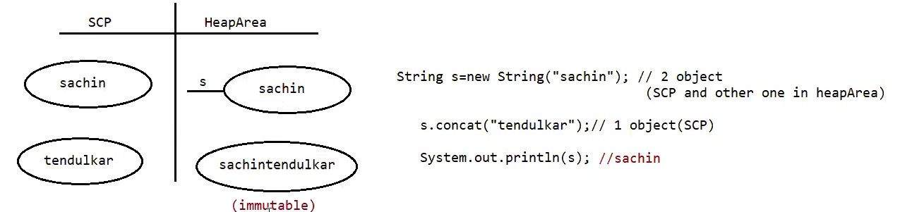
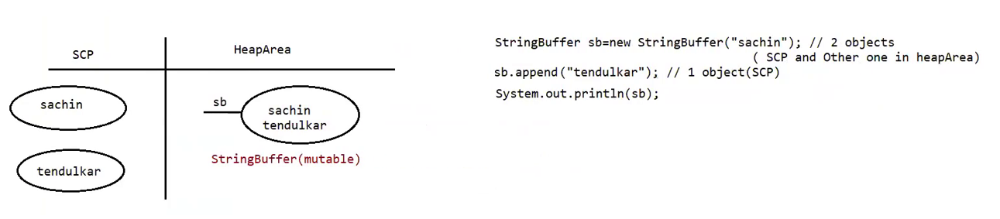

# Strings in Java

1. **String class (java.lang)**:
   - It represents a sequence of characters in Java and is used to store and manipulate textual data.
   - Strings are classified into two types: immutable and mutable.

2. **Immutable String**:
   - In Java, once a String object is created, its value cannot be changed.
   - When you perform any operation on an immutable String (e.g., concatenation, trimming, etc.), a new String object is created, leaving the original String unchanged.
   - Example:
     ```java
     String s = new String("sachin");
     s.concat("tendulkar™"); // Creates a new String object with "sachintendulkar™", but s remains "sachin".
     System.out.println(s); // Output: "sachin"
     ```
   - This immutability ensures thread safety and makes String objects suitable for use as keys in hash maps or other data structures.

3. **Mutable String (StringBuffer and StringBuilder)**:
   - Unlike the String class, StringBuffer and StringBuilder are mutable classes that allow you to modify the content of the object without creating a new one.
   - StringBuffer was introduced in Java 1.0, and StringBuilder was introduced in Java 1.5 as a more efficient, non-synchronized version of StringBuffer.
   - The main difference between StringBuffer and StringBuilder is that StringBuffer is synchronized, meaning it is thread-safe but may have some performance overhead, while StringBuilder is not synchronized and may perform better in single-threaded scenarios.

4. **Case 1 - Immutable String**:
    ```java
    // Code
    String s = new String("sachin"); // 2 objects (SCP and another one in heapArea)
    s.concat("tendulkar™"); // 1 object (SCP)
    System.out.println(s);

    // Output: "sachin"
    ```
    
   - Here, a new String object is created and stored in the String Constant Pool (SCP) using the `new` keyword. Another object is also created in the heap area to store the content "sachin".
   - When the `concat` method is called on the `s` String object, a new String object "sachintendulkar™" is created in the SCP, but the original `s` object remains unchanged.
   - The `System.out.println(s)` statement prints the original value of `s`, which is "sachin".

5. **Case 1 - Mutable String (StringBuffer)**:
   ```java
    // Code
    StringBuffer sb = new StringBuffer("sachin"); // 2 objects (SCP and another one in heapArea)
    sb.append("tendulkar"); // 1 object (SCP)
    System.out.println(sb);

    // Output: "sachintendulkar"
    ```
    
   - Similarly, a new StringBuffer object is created and stored in the SCP, and another object is created in the heap area to store the content "sachin".
   - When the `append` method is called on the `sb` StringBuffer object, the content of the `sb` object is modified directly in the same memory, and no new object is created.
   - The `System.out.println(sb)` statement prints the modified content of `sb`, which is "sachintendulkar™".

6. **Case 2 - Comparing Immutable Strings**:
   ```java
    // Code
    String s1 = new String("sachin"); // 2 objects (SCP and another one in heapArea)
    String s2 = new String("sachin"); // 1 object (heapArea)
    System.out.println(s1.equals(s2)); // equals method is implemented to check the content of the String

    // Output: true
    ```
   - In this case, two String objects `s1` and `s2` are created with the same content "sachin".
   - Since Strings are immutable, the JVM optimizes the memory usage by storing the content only once in the SCP. Therefore, `s1` and `s2` will point to the same String object in the SCP.
   - When using the `equals` method to compare `s1` and `s2`, it checks the content of the Strings, and as they have the same content, the comparison returns `true`.

7. **Case 2 - Comparing Mutable Strings (StringBuffer)**: 
    ```java
    // Code
    StringBuffer sb1 = new StringBuffer("sachin");
    StringBuffer sb2 = new StringBuffer("sachin");
    System.out.println(sb1.equals(sb2)); // equals method is not available in StringBuffer class, it is a part of the Object class so the implementation is coming from Object class, which compares the reference, not the data.

    // Output: false

    ```
   - Here, two StringBuffer objects `sb1` and `sb2` are created with the content "sachin".
   - Unlike immutable Strings, StringBuffer does not have an overridden `equals` method to compare the content. Instead, it inherits the `equals` method from the `Object` class.
   - The default implementation of `equals` in the `Object` class performs reference comparison, not content comparison. Since `sb1` and `sb2` are separate objects in memory, the comparison using `equals` will return `false`.

In summary, immutability makes String objects thread-safe and ensures they cannot be modified once created. On the other hand, StringBuffer and StringBuilder are mutable classes, allowing you to modify their content directly, but they are not thread-safe. When comparing Strings, the `equals` method checks their content, while for StringBuffer, it uses the default reference comparison from the `Object` class, which compares memory addresses.


<br/>
<br/>

# **Final Access Modifier**:

The `final` keyword is an access modifier in Java that can be applied at three levels: variable (primitive and reference), class level, and method level.

**1. Final Variable:**
   - When a variable is declared as `final`, its value cannot be changed after initialization. It becomes a constant, and any attempt to modify it results in a "CompileTimeError."
   - Final variables must be initialized either during declaration or in the constructor of the class.
   - Final variables are resolved at compile time by the compiler, meaning their values are determined during the compilation phase and cannot be changed during runtime.

```java
class Test{
    public static void main(String[] args){
        final int a = 10;
        int b = 20;
        b++;
        a++; // CompileTimeError: The final local variable a cannot be assigned. It is already defined in the method main.
        System.out.println(a);
        System.out.println(b); // Output: 21
    }
}
```

**2. Final vs Immutability:**

   - Final variables and immutability are related but not the same concept.

     - **Final Variable**:
       - When a variable of primitive type is declared as `final`, its value cannot be changed.
       - When a variable of reference type is declared as `final`, the reference cannot be reassigned to a new object, but the object's data can be changed if the object is mutable.
       - Final variables provide a guarantee that their value or reference will not change after initialization.

     - **Immutability**:
       - Immutability refers to the inability of an object to be modified after it is created.
       - Immutable objects have all their data fields as final, and their state cannot be changed once they are constructed.
       - String is an example of an immutable class in Java.

```java
class Test{
    public static void main(String[] args){
        final StringBuffer sb = new StringBuffer("sachin");
        sb.append("IND"); // Appends "IND" to the existing content of sb
        System.out.println(sb); // Output: "sachinIND"

        sb = new StringBuffer("tendulkar"); // CompileTimeError: The final local variable sb cannot be assigned. It is already defined in the method main.
        System.out.println(sb);
    }
}
```

**Note**:

- Final variables are used to create constants in Java, which are helpful for maintaining read-only values throughout the program execution.
- Immutable objects provide benefits like thread-safety, easy caching, and safer data sharing in a multi-threaded environment. String is the most commonly used example of an immutable object in Java.

In summary, the `final` keyword is used to make variables constant, and their values cannot be changed after initialization. It ensures the value or reference remains unchanged during the program's execution. However, immutability, on the other hand, refers to objects whose state cannot be modified once they are created, and this can be achieved by declaring all data fields as `final` in the class.

<br/>
<br/>

# **StringBuffer**:

The `StringBuffer` class is available in the `java.lang` package in Java. It is a mutable sequence of characters and is used to represent dynamic strings. Unlike the `String` class, which is immutable and cannot be modified once created, `StringBuffer` provides methods to modify its content.

**Methods of StringBuffer**:

1. **`capacity()`**:
   - The `capacity()` method of `StringBuffer` returns the current capacity of the StringBuffer object.
   - The default capacity of a StringBuffer object is 16 characters.
   - If the capacity is filled, the JVM automatically increases the size of the StringBuffer using the formula: `newCapacity = (currentCapacity + 1) * 2`.

2. **`length()`**:
   - The `length()` method of `StringBuffer` returns the number of characters present in the StringBuffer object.
   - It counts the length of the content in the StringBuffer.

3. **`append(String)`**, **`append(Boolean)`**, **`append(float)`**:
   - The `append()` method is used to add data to the existing StringBuffer object.
   - There are various overloaded `append` methods to handle different data types, such as String, Boolean, and float.
   - The method appends the given data to the end of the existing content in the StringBuffer.

4. **`insert(int, String)`**, **`insert(int, int)`**, **`insert(int, float)`**:
   - The `insert()` method is used to insert the given data at the specified index in the StringBuffer object.
   - The method shifts the existing content to accommodate the new data at the specified index.

5. **`delete(int, int)`**, **`deleteCharAt(int)`**:
   - The `delete()` method is used to remove a portion of the content in the StringBuffer.
   - `deleteCharAt()` is used to delete a character at a specific index.

6. **`reverse()`**:
   - The `reverse()` method is used to reverse the order of characters in the StringBuffer object.

7. **`setLength()`**, **`trimToSize()`**, **`ensureCapacity(int)`**:
   - The `setLength()` method allows you to reduce the length of the content in the StringBuffer at runtime.
   - The `trimToSize()` method reduces the capacity of the StringBuffer to match the length of the content.
   - The `ensureCapacity(int)` method is used to increase the capacity of the StringBuffer to the specified limit.

## **Examples**:

**1. Example of `capacity()` and `append()` methods:**

```java
StringBuffer sb = new StringBuffer();
System.out.println(sb.capacity()); // 16

sb.append("The value of PIE IS :: ");
sb.append(3.1414);
sb.append(", This is exactly ::");
sb.append(true);

System.out.println(sb);
System.out.println(sb.capacity()); // 70
System.out.println(sb.length()); // 54
```

**2. Example of `insert()` method:**

```java
StringBuffer sb = new StringBuffer("abcdefgh");
System.out.println(sb.capacity()); // 8 + 16 => 24

sb.insert(2, "xyz");
System.out.println(sb); // abxyzcdefgh

sb.insert(11, 9);
System.out.println(sb); // abxyzcdefgh9
```

**3. Example of `delete()` and `deleteCharAt()` methods:**

```java
StringBuffer sb = new StringBuffer("sachinrameshtendulkar");
System.out.println(sb.capacity()); // 21 + 16 => 37
System.out.println(sb.length()); // 21

sb.delete(6, 12);
System.out.println(sb); // sachintendulkar

sb.deleteCharAt(6);
System.out.println(sb); // sachinendulkar

sb.deleteCharAt(21); // StringIndexOutOfBoundsException (SIOBE) since index 21 is not valid for the current content.
```

**4. Example of `setLength()` method:**

```java
StringBuffer sb = new StringBuffer("sachinrameshtendulkar");
System.out.println(sb); // sachinrameshtendulkar
System.out.println(sb.length()); // 21

sb.setLength(6);
System.out.println(sb.length()); // 6
System.out.println(sb); // sachin
```

**5. Example of `trimToSize()` method:**

```java
StringBuffer sb = new StringBuffer(1000);
System.out.println(sb.capacity()); // 1000

sb.append("Shivam");
System.out.println(sb.capacity()); // 1000

sb.trimToSize();
System.out.println(sb.capacity()); // 6 (trimmed to the length of the content)
```

**6. Example of `ensureCapacity()` method:**

```java
StringBuffer sb = new StringBuffer();
System.out.println(sb.capacity()); // 16

sb.ensureCapacity(10000);
System.out.println(sb.capacity()); // 10000 (increased to the specified limit)
```

**Difference between StringBuilder and StringBuffer**:

- `StringBuffer` (1.0 V, 1996):
  - All the methods present in `StringBuffer` are synchronized.
  - Only one thread can operate on a `StringBuffer` object at a time, making it "ThreadSafety."
  - The performance of `StringBuffer` is relatively lower due to the synchronization overhead.

- `StringBuilder` (1.5 V):
  - All the methods present in `StringBuilder` are not synchronized.
  - Multiple threads can operate on a `StringBuilder` object simultaneously, making it not "ThreadSafety."
  - The performance of `StringBuilder` is higher than `StringBuffer` due to the absence of synchronization.

In summary, `StringBuffer` and `StringBuilder` are used for the same purpose of manipulating dynamic strings. The primary difference lies in their thread-safety characteristics, where `StringBuffer` is thread-safe but with lower performance, and `StringBuilder` is not thread-safe but provides better performance in single-threaded environments.